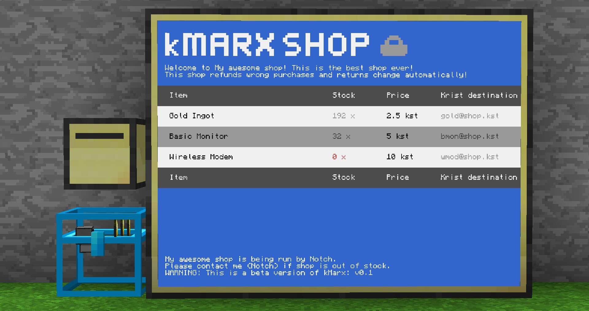
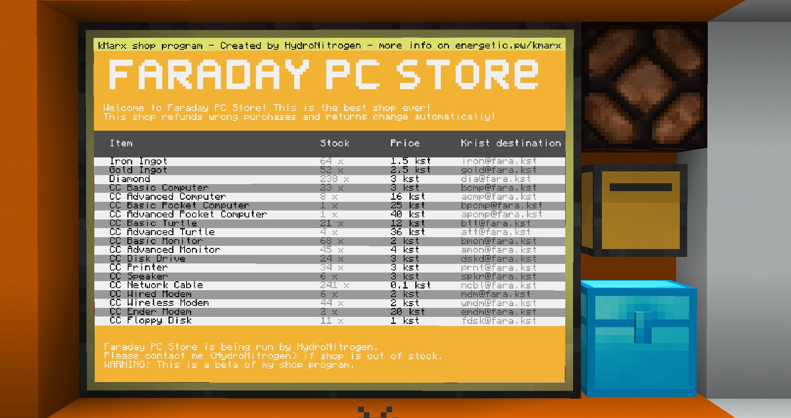
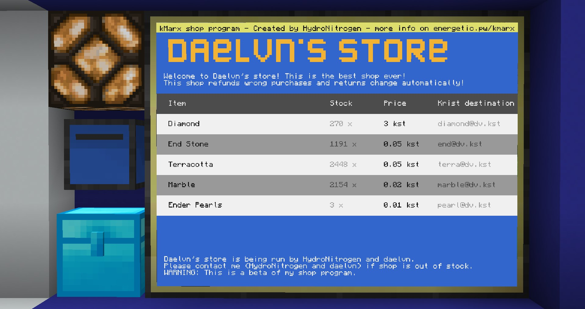

# Archival repository featuring HydroNitrogen's kMarx
This is an archival repository for the ComputerCraft program 'kMarx' - an early krist-currency shop platform.

**Please note:** This program is not kept up-to-date and is not suitable for production use.

The contents below are copied (sic) from the original website-page made on April 4, 2018, ([https://energetic.pw/computercraft/kmarx/](https://energetic.pw/computercraft/kmarx/)) by HydroNitrogen.

---

> > WARNING: This shop is still in bleeding edge beta! Use with caution, don't hold me responsible for any damage that may occur to you or your krist!
> 
> > WARNING: kMarx versions v0.1 (1) and v0.2 (2) contain critical security vulnerabilities! Please update to version v0.4 as soon as possible to protect your krist and resources!
> 
> # kMarx by HydroNitrogen
> 
> An open, transparent, fast, compatible, good looking and heavily customizable shop program for Computercraft in combination with kristpay and Plethora.
> 
> ### Most recent version: v0.4 (2020-02-05)
> 
> | Version  | Info                      | Type | Date       | Code                 | Config                       | Compatible with                        |
> | -------- | ------------------------- | ---- | ---------- | -------------------- | ---------------------------- | -------------------------------------- |
> | v0.4 (4) | Definite hotfix version.  | beta | 2020-02-05 | [shop.lua](shop.lua) | [shopData.lua](shopData.lua) | v0.1 (1), v0.2 (2), v0.3 (3), v0.4 (4) |
> | v0.3 (3) | Temporary hotfix version. | beta | 2020-02-04 | Unavailable          | Unavailable                  | v0.1 (1), v0.2 (2), v0.3 (3)           |
> | v0.2 (2) | Bug and features update.  | beta | 2018-04-09 | Unavailable          | Unavailable                  | v0.1 (1), v0.2 (2)                     |
> | v0.1 (1) | First public release.     | beta | 2018-04-04 | Unavailable          | Unavailable                  | v0.1 (1)                               |
> 
> Copy paste this to CC to run yourself:
> 
> ```
> wget https://github.com/Wendelstein7/kMarx/blob/main/shop.lua startup.lua
> ```
> 
> I've not written any documentation on the config file, but I guess most of it is self explainatory.
> \
> A description and detailed information about the shop, how to edit the configuration file, etc will follow soon.\
> For now, figure stuff out yourself or ask me (HydroNitrogen) ingame or on Discord. Thanks!
> 
> 
> 
> 
> 
> 
> 
> 
> 
